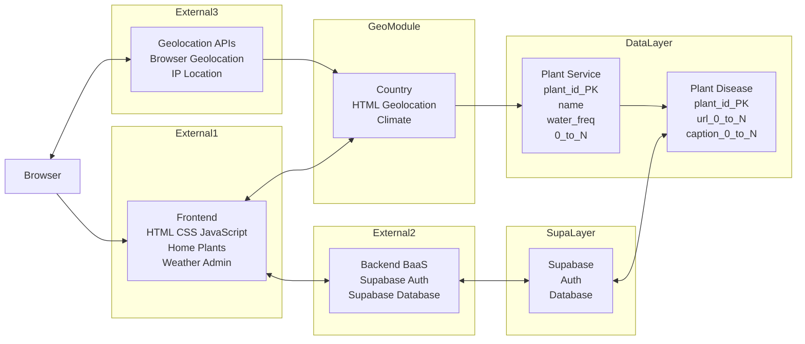
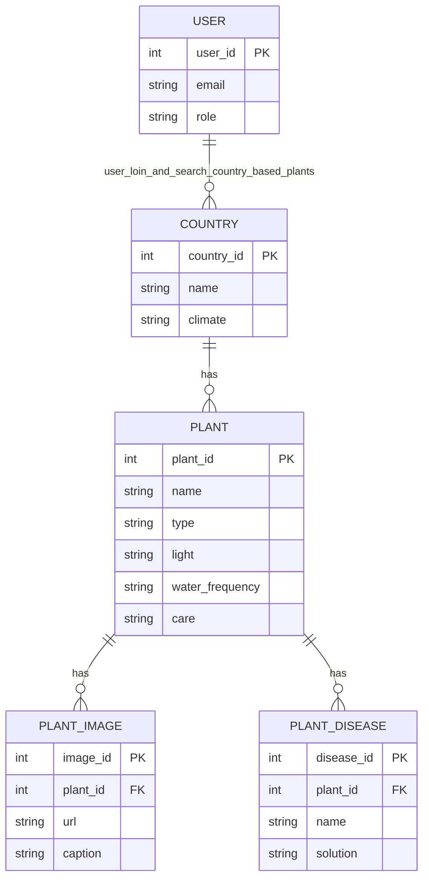
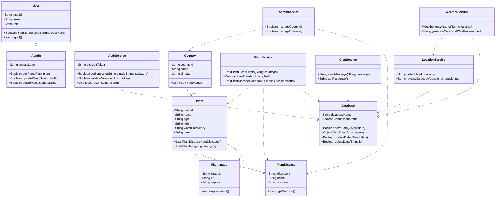
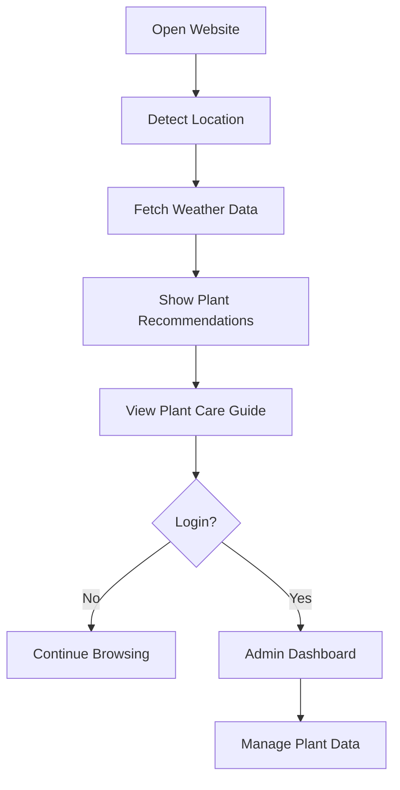

# PLANT CARE ASSISTANT

## Project Report

### 1. Introduction
Plant Care Assistant is a frontend-first web application designed to help users select and maintain plants according to their geographical location and real-time weather conditions. The system automatically detects the user's location, fetches live weather data, and recommends suitable plants along with proper care instructions. The project is built using core web technologies such as HTML, CSS, and Vanilla JavaScript without any build tools or frameworks. It integrates external APIs for weather and location services and uses Supabase for authentication and data management. An optional local AI chatbot powered by Ollama enhances the user experience by answering plant-related questions.

### 2. Objectives
- Detect the user's location automatically
- Display real-time weather information
- Recommend plants based on country and climate
- Provide plant care instructions
- Implement an admin dashboard for plant data management
- Support offline fallback functionality
- Optionally integrate a local AI chatbot for assistance

### 3. Key Features
- Automatic location detection with IP and browser geolocation fallback
- Live weather display with OpenWeather and Open-Meteo fallback
- Country-based plant recommendations and care guides
- Plant issues and solutions for common diseases
- Admin dashboard for CRUD operations on plant data
- Offline demo mode using localStorage
- Optional local AI chatbot for plant care assistance
- Responsive UI across devices

### 4. Technologies Used
**Frontend Technologies**
- HTML5
- CSS3
- Vanilla JavaScript

**APIs and External Services**
- Browser Geolocation API
- OpenWeather API
- Open-Meteo API
- IP-based location services (ipapi, ipwho, ipinfo)

**Backend-as-a-Service**
- Supabase Authentication
- Supabase Database

**Storage**
- localStorage
- sessionStorage

**Optional AI Integration**
- Node.js backend
- Ollama (TinyLlama model)

**Development Tools**
- Visual Studio Code
- Git and GitHub
  
##  Folder Structure

plant-care-assistant/
├── index.html              # Home page
├── weather.html            # Weather information page
├── plants.html             # Country-wise plants & care page
├── about.html              # About page
│
├── css/
│   └── style.css           # Main stylesheet (responsive, 800+ lines)
│
├── js/
│   ├── main.js             # Shared utilities and helper functions
│   ├── weather.js          # Weather page logic and API calls
│   ├── plants.js           # Plants page logic and data display
│   └── data.js             # Plant database for different countries
│
├── data/
│   └── (Optional JSON files for large datasets)
│
└── README.md               # This file

##  Quick Start Guide

### Prerequisites
- Any modern web browser (Chrome, Firefox, Safari, Edge)
- VS Code (recommended)
- Live Server extension for VS Code

### Installation & Setup

#### Step 1: Download/Extract Project
1. Extract the plant-care-assistant folder to your desired location
2. Open the folder in VS Code

#### Step 2: Install Live Server (if not already installed)
1. Open VS Code
2. Go to Extensions (Ctrl+Shift+X / Cmd+Shift+X)
3. Search for "Live Server"
4. Install the extension by Ritwick Dey

#### Step 3: Configure OpenWeather API (Optional but Recommended)
1. Visit https://openweathermap.org/api
2. Create a free account
3. Go to API keys section
4. Copy your API key
5. Open js/weather.js
6. Replace 'YOUR_API_KEY_HERE' with your actual API key on line 7:
   javascript
   const OPENWEATHER_API_KEY = 'your_actual_key_here';
   

#### Step 4: Run the Application
1. Right-click on index.html in VS Code
2. Select "Open with Live Server"
3. The app will open in your browser at http://localhost:5500

#### Step 5: Explore the Application
- *Home Page* - See your detected location
- *Weather Page* - View real-time weather and plant care recommendations
- *Plants Page* - Browse plants specific to your country and region
- *About Page* - Learn about the project and technology stack

### 5. System Overview
The Plant Care Assistant follows a frontend-first architecture where all primary functionalities are handled using static HTML, CSS, and JavaScript files. The application interacts with:
- Weather APIs for climate data
- Geolocation APIs for location detection
- Supabase for authentication and admin data
- Optional local AI backend for chatbot functionality

The system is designed to work even without backend dependency using offline fallback mechanisms.

### 6. System Architecture
**Components**
1. User Browser - Interface where users access the application
2. Frontend Layer - HTML, CSS, and JavaScript pages
3. External APIs - Weather and location services
4. Supabase - Authentication and database management
5. Optional AI Backend - Local chatbot using Ollama

**Architecture Diagram (Mermaid)**

### 7. ER Diagram (Entity Relationship Diagram)
**Entities**
1. User
   - user_id (Primary Key)
   - email
   - role
2. Country
   - country_id (Primary Key)
   - name
   - climate
3. Plant
   - plant_id (Primary Key)
   - name
   - type
   - light
   - water_frequency
   - care
4. PlantImage
   - image_id (Primary Key)
   - plant_id (Foreign Key)
   - url
   - caption
5. PlantDisease
   - disease_id (Primary Key)
   - plant_id (Foreign Key)
   - name
   - solution

**Relationships**
- A Country has many Plants
- A Plant has many Images
- A Plant has many Diseases

**ER Diagram (Mermaid)**

### 8. Class Diagram
**Service Classes**
1. LocationService
   - detectUserLocation()
2. WeatherService
   - getWeather()
   - generateCareTips()
3. PlantService
   - loadPlants()
   - getPlantDetails()
4. AuthService
   - login()
   - register()
5. AdminService
   - addPlant()
   - updatePlant()
   - deletePlant()

**Class Diagram (Mermaid)**

### 9. Workflow Diagram
**Workflow Steps**
1. User opens website
2. Location is detected
3. Weather data is fetched
4. Plant recommendations are displayed
5. User views plant care guide
6. Optional: User logs in
7. Optional: Admin manages plant data

**Workflow Diagram (Mermaid)**

### 10. Module Description
**10.1 Location Detection Module**
Detects user location using browser geolocation. If unavailable, it falls back to IP-based services. The detected location is stored in sessionStorage.

**10.2 Weather Module**
Fetches weather data from OpenWeather API. If API key is unavailable, Open-Meteo is used as fallback. Based on weather conditions, plant care suggestions are generated.

**10.3 Plant Recommendation Module**
Displays country-specific plant data including climate, common plants, common problems, and care guidelines using PLANTS_DATABASE.

**10.4 Authentication Module**
Uses Supabase authentication for login and registration. Also supports offline admin login using localStorage.

**10.5 Admin Dashboard Module**
Allows administrators to manage:
- Countries
- Plants
- Plant images
- Plant diseases

Supports both online (Supabase) and offline modes.

**10.6 AI Chatbot Module (Optional)**
A local Node.js server communicates with Ollama to provide plant care assistance based on the plant dataset.

### 11. How the System Works
1. When the user opens the Home page, the system detects the location.
2. The Weather page fetches live weather data.
3. The Plants page shows country-specific plant recommendations.
4. The Admin page allows plant data management.
5. The Chatbot assists users with plant-related queries.

### 12. Advantages of the System
- Lightweight frontend architecture
- No build tools required
- Real-time weather integration
- Country-based plant guidance
- Admin management panel
- Optional AI support
- Responsive and modern UI

### 13. Limitations
- Dependent on external APIs
- AI chatbot requires local setup
- Some plant data may need further validation

### 14. Future Scope
- Mobile application version
- More country plant datasets
- Cloud-based AI assistant
- Multilingual support
- Push notifications for plant care reminders
- Integration with IoT plant sensors

### 15.🔗 Useful Links

- *IP-API* - https://ipapi.co
- *OpenWeather API* - https://openweathermap.org/api
- *MDN Web Docs* - https://developer.mozilla.org
- *VS Code* - https://code.visualstudio.com
- *Live Server* - https://github.com/ritwickdey/vscode-live-server

### Version 1.0 (Initial Release)
-  Complete frontend application
-  6 countries with plant data
-  Real-time weather integration
-  Responsive design
-  Comprehensive documentation

---

*Created:* January 2024  
*Last Updated:* January 2026  
*Status:* Complete and Ready for Use

 *Happy Plant Caring!*

